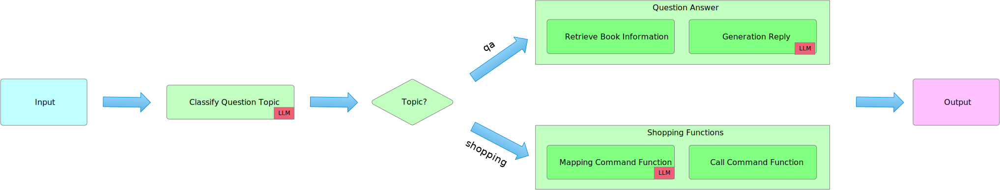

## 图书销售顾问

本项目是一个图书销售顾问应用程序，借助 LLM 模型的语义理解、推理、计划、生成能力，实现一个在线图书销售顾问，能够根据用户的输入，理解用户的意图，推荐合适的图书。

### 数据来源

本项目图书知识库数据生成于ChatGPT，数据集包含了图书的名称、作者、出版社、出版日期、价格等信息，以及图书的简介、目录、前言等内容。

数据并未做真实验证，仅用于演示使用。

数据文件可以在[这里](resources)
查看，原始语料请参阅[ChatGPT](https://chat.openai.com/share/5b031b99-8543-4cc7-835d-681880d4c236)

### 运行

```shell
cd booksales-consultant
python gradio_ui.py
```

### 特性

- [x] 咨询问答
- [x] 购物车
- [ ] 订单管理
- [ ] 添加书籍

### 主要文件

- book_sales_consultant.py: 图书顾问主程序
- shopping_cart.py: 购物车模块
- bookstore.py: 图书语料库
- gradio_ui.py: Gradio UI

### 实现流程

